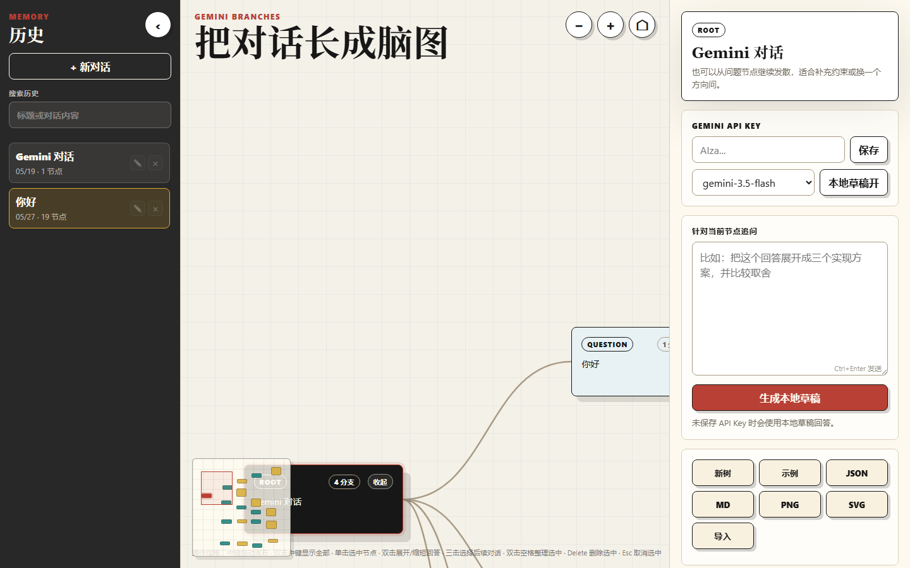

# Forkscape - AI 对话脑图

Forkscape 是一个面向 AI 对话的分支画布工具。它把 Gemini 对话整理成类似脑图的工作区，让每一次回答都可以继续追问、分叉探索、拖动画布整理，并保存成自己的思考历史。

我是一个业余小白，这个项目是我根据自己的日常需求一点点做出来的。它不是一个成熟商业产品，而是一个为了让 AI 对话更容易回看、分支和整理的小型个人项目。



当前版本：`v0.4.0`

## 适合谁用

- 经常用 AI 做长对话，但不想让思路混在一条聊天记录里的人。
- 想把一个问题拆成多个方向，同时保留不同分支答案的人。
- 用 Gemini 做学习、写作、产品设计、方案比较、灵感整理的人。
- 喜欢本地保存对话，不想每次重新找上下文的人。

## 主要功能

- 从任意 AI 回答继续追问，而不是只能顺着一条线性聊天往下聊。
- 用脑图式画布展示 Gemini 对话分支。
- 支持鼠标滚轮缩放、左键/中键拖动画布、拖动对话框整理位置。
- 长回答会自动折叠，悬停可预览，双击可固定展开或缩短。
- 历史会话可搜索、手动排序、重命名和删除。
- 大画布支持缩略图、隐藏滚动条、双击中键显示全部对话框。
- 背景格子会跟随画布移动和缩放，方便判断空间位置。
- 支持整条分支折叠和展开，适合整理大型对话树。
- 模型列表只保留常用 Gemini 文本生成模型。
- 支持 JSON 导入/导出，用于备份和恢复对话树。
- 支持 Markdown、PNG、SVG 导出，用于笔记、分享和文档整理。

## 最新更新

`v0.4.0` 扩展了日常使用流程：

- 新增历史搜索，可搜索会话标题和对话内容。
- 新增分支折叠/展开。
- 新增双击中键显示全部对话框。
- 新增 Markdown、PNG、SVG 导出。
- 画布格子改为跟随对话框一起移动和缩放。
- README 改为中文优先的中英双语介绍。
- 继续确保 API Key、本地会话和日志不会进入 Git。

完整记录见 [CHANGELOG.md](CHANGELOG.md)。

## 快速开始

Windows 上可以双击：

```text
open-app.cmd
```

然后打开：

```text
http://localhost:4173
```

也可以手动运行：

```bash
node server.mjs
```

## Gemini API Key

Forkscape 不附带 API Key。你需要在应用里粘贴自己的 Gemini API Key。

在当前这个本地原型里，Key 只保存在你的浏览器/本地运行环境中。请不要把 API Key、`.env` 文件、日志或本地会话历史提交到 Git。

## 本地数据

本地会话历史保存在：

```text
.gemini-branch-sessions.json
```

这个文件已被 Git 忽略，不会上传到 GitHub。

## 项目状态

Forkscape 仍然是早期原型。接下来比较适合继续做：

- 导出 Mermaid 图。
- 支持只导出选中的分支。
- 把 Gemini API 请求移动到后端代理，适合未来部署版本。

## English Version

Forkscape is a branching canvas for AI conversations. It turns a Gemini chat into a mind-map-like workspace where every answer can be forked, explored, dragged, and saved as part of your thinking history.

I am a hobbyist beginner, and I built Forkscape around my own everyday needs. It is a small personal project made to make AI conversations easier for me to explore, branch, and revisit.

Current version: `v0.4.0`

## Who It Is For

- People who often have long AI conversations and want to keep ideas organized.
- People who want to explore several directions from the same question.
- People using Gemini for learning, writing, product thinking, comparison, or brainstorming.
- People who prefer keeping conversation history locally.

## Features

- Branch from any AI answer instead of continuing in one linear chat.
- Visual mind-map canvas with draggable nodes and connection lines.
- Mouse wheel zoom, left/middle-button canvas panning, and draggable conversation cards.
- Auto-collapsing long answers with hover preview and double-click pinning.
- Persistent local conversation history through the bundled local server.
- Searchable, manually reorderable, renameable, and deletable history sessions.
- Large canvas navigation with a minimap, hidden scrollbars, double-middle-click overview, and grid movement tied to the canvas.
- Branch collapse and expand controls for large maps.
- Curated Gemini model selector for common text generation models.
- JSON import/export for backups and restoration.
- Markdown, PNG, and SVG export for notes, sharing, and documentation.

## Latest Update

`v0.4.0` expands Forkscape's daily-use workflow:

- Added history search across session titles and conversation contents.
- Added branch collapse/expand controls for large maps.
- Added double-middle-click overview to show the whole conversation map.
- Added Markdown, PNG, and SVG export formats.
- Moved the grid background onto the canvas so it pans and zooms with conversation cards.
- Reorganized the README into a Chinese-first bilingual introduction.
- Kept API keys and local session data out of Git.

See [CHANGELOG.md](CHANGELOG.md) for release notes.

## License

MIT
